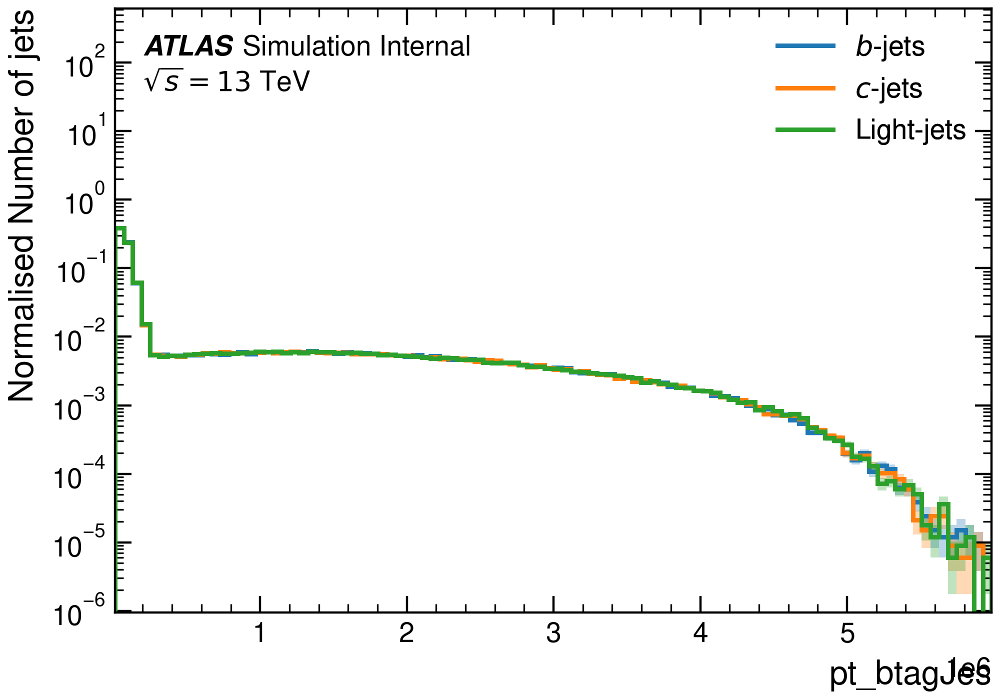

# UPP: Umami Preprocessing 

Welcome to the Umami PreProcessing (UPP) package, a modular preprocessing pipeline for jet tagging.
UPP is used to preparing datasets for training various taggers. 
In particular, it handles hybrid sample creation, resampling, normalisation, and shuffling.

The code is hosted on the Github:

- [https://github.com/umami-hep/umami-preprocessing](https://github.com/umami-hep/umami-preprocessing)

You can find information about tagger training and FTAG software at the central [docs pages](https://ftag.docs.cern.ch/algorithms/GNN/).

???+ info "UPP tutorial"

    A tutorial on how to use the framework is provided at the [central FTAG docs page](update-link)

## Introduction

Input ntuples for the preprocessing are produced using the [training-dataset-dumper](https://gitlab.cern.ch/atlas-flavor-tagging-tools/training-dataset-dumper) which which converts from ROOT files to HDF5 ntuples.
A list of available h5 ntuples is maintained in the central [FTAG documentation pages](https://ftag.docs.cern.ch/software/samples/).
However, the ntuples listed there are not directly suitable for algorithm training and require preprocessing (handled by this package).

This library is alredy used to preprocess data for [Salt](https://gitlab.cern.ch/atlas-flavor-tagging-tools/algorithms/salt/) framework.
UPP is planned to be integrated into [Umami](https://gitlab.cern.ch/atlas-flavor-tagging-tools/algorithms/umami) framework for training of Umami/DIPS and DL1r and replace current umami preprocessing, as it addresses [several issues](https://gitlab.cern.ch/atlas-flavor-tagging-tools/algorithms/umami/-/issues/?label_name%5B%5D=Preprocessing) with the current umami preprocessing workflow, and uses the [`atlas-ftag-tools`](https://github.com/umami-hep/atlas-ftag-tools/) package extensively.

## Motivation

the primary motivation behind preprocessing the training samples is to ensure that the distributions of kinematic variables such as $p_T$ and $\eta$ are the same for all flavors.
This uniformity in kinematic distributions is crucial to avoid kinematic biases in the tagging performance.
In order to ensure the uniformity in kinematic distributions, resampling techniques are employed.
These techniques involve removing samples from the majority class (under-sampling) and/or adding more samples from the minority class (over-sampling).

The preprocessing can also be used to control the number of jets of each flavour, to stitch together jets from various samples, and to perform the shuffling an normalisation.

## Hybrid Samples
Umami/DIPS and DL1r are trained on so-called hybrid samples created by combining $t\bar{t}$ and $Z'$ jets using a $p_T$ threshold, which is defined by the `pt_btagJes`.
Below a certain pt threshold (which needs to be defined for the preprocessing), $t\bar{t}$ events are used in the hybrid sample.
Above this pt threshold, the jets are taken from $Z'$ events.
The advantage of these hybrid samples is the availability of sufficient jets with high pt, as the $t\bar{t}$ samples typically have lower-pt jets than those jets from the $Z'$ sample.

The following image show the distributions of jet flavours in both samples

After applying `pdf` resampling with upscaling, we achieve the following combined distributions for jets:

It's worth noting that, while we used $t\bar{t}$ and $Z'$ samples here for illustrative purposes, you can use any type of samples.
Additionally, you're not obligated to create a hybrid sample; UPP can still be used with a single sample for preprocessing.

